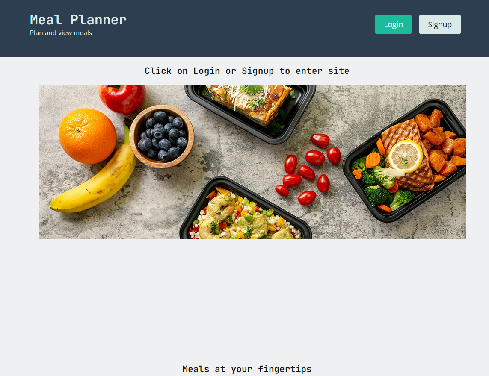

# Meal Planner

  
  
  ## Description
  ---
  An application that allows users to record mealplans for the future and now by being able to review meals from the past.

  Below is a screenshot of the main page

  
  
  ## Table of Contents
  - [Installation](#installation)
  - [Usage](#usage)
  - [License](#license)
  - [Contributing](#contributing)
  - [Questions](#questions)
  
  ## Installation
  To install, download the code from GitHub. To run server type in "node server.js' from the command prompt.
  
  ## Usage
  Open [website](https://polar-ocean-42088.herokuapp.com/) in browser.
  
  ## License
  This application is covered under the MIT License license.
  
  ---
  ## Contributing
  This code a is for learning purposes and contribution is not neccessay.
  
  ## Tests
  This code a is for learning purposes and testing is not neccessay.
  
  ## Questions
  My Git hub profile id [https://github.com/scottyv6](https://github.com/scottyv6).
  I can be reached at [scottyv6@gmail.com](mailto:scottyv6@gmail.com) for further questions.